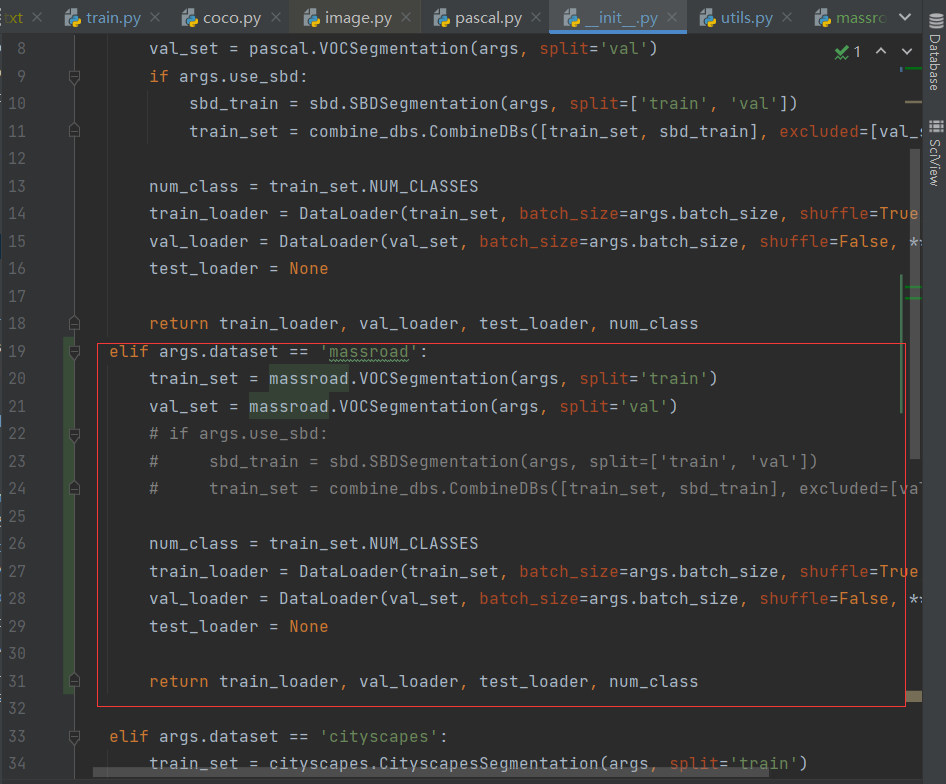

# 一种基于DeepLabv3+的改进的道路提取模型

[DeepLab源代码仓库](https://github.com/jfzhang95/pytorch-deeplab-xception)

## 修改1

[原文代码](https://github.com/jfzhang95/pytorch-deeplab-xception)

启动前应补充包

```bash
pip install scipy

pip install pycocotools

pip install tensorboardX
```

### 数据预处理

[参考方法](https://blog.csdn.net/qq_39056987/article/details/106455828)

仿照VOC数据集来读取马萨诸塞州道路数据集，数据预处理文件`massroad.py`,其中为了防止过拟合，用了50%随机垂直翻转和水平翻转和随机裁剪，又用了归一化到-1到1


#### 仿VOC格式

文件结构

```
- ImageSets
	- Segmentation
		- train.txt
		- trainval.txt
		- val.txt
- JPEGImages
- SegmentationClass
```

JPEGImages 放原图

SegmentationClass里面放对应的mask图片png格式,和JPEGImages里的图片一一对应

ImageSets/ Segmentation的txt文件中放去掉后缀的图片名

#### 修改代码

1.在mypath.py中添加自己的数据集名称与路径


2.在同级目录中修改train.py约185行添加自己数据集的名称


3.在dataloaders目录下修改__init__.py

在第一行添加数据集名称，复制'pascal'数据集描述，把名称修改为自己数据集的名字



4.修改dateloaders目录下utils.py

设置每一类别的颜色显示


添加分割类别数


定义massroad.py文件


### 模型测试

[参考方法](https://blog.csdn.net/qq_39056987/article/details/106455828)

测试指令

```bash
python demo.py --in-path ./test --ckpt run/massroad/deeplab-resnet/model_best.pth.tar --backbone resnet --dataset massroad
```

修改测试数据集参数，修改批量归一化到（-1，1）

测试图片放到test文件夹下

### 启用默认参数（args.use_balanced_weights）


默认情况下该参数是关闭的，但是我们知道数据集中道路标签相比背景占比过低，导致训练的图像道路总是缺损。启用该参数后，会生成一个权重文件。


通过`weight[1]=weight[1]/50*3.1`,可以通过该语句修改权重比达到更好的mIoU，但是达到最好的mIoU时（`weight[1]=weight[1]/50*3.1`），主干道路本身会有缺损，而且会有一定的在标签图不存在的细小道路被标注出来

### 保存更多的实验结果

原代码只能保留最多十个实验结果，修改代码后可以保留无上限，但是缺点是必须预先生成目录


### 网络结构试调整

#### 解决忽略白色像素点问题

在VOC数据集中，标签标注的标签类边缘用255（白色像素点）填充，也就是默认是忽略白色像素点，但是我们的massroad数据集就是用白色标签来标注道路的。为了解决这个问题，我们采取如下策略：直接除以255，将其换为1，而原图经过批量规范化后范围也是（-1，1）


#### 尝试在ASPP模块中加入注意力模块

[参考代码1](https://blog.csdn.net/qq_45014374/article/details/127507120)

[参考代码2](https://blog.csdn.net/qq_43745026/article/details/126919295)

改进主要在`aspp.py`中,试了三个模块，加上之后反而有一定程度下滑，从0.6948将为0.687

注意力模块

```py
class SE_Block(nn.Module):                         # Squeeze-and-Excitation block
    def __init__(self, in_planes):
        super(SE_Block, self).__init__()
        self.avgpool = nn.AdaptiveAvgPool2d((1, 1))
        self.conv1 = nn.Conv2d(in_planes, in_planes // 16, kernel_size=1)
        self.relu = nn.ReLU()
        self.conv2 = nn.Conv2d(in_planes // 16, in_planes, kernel_size=1)
        self.sigmoid = nn.Sigmoid()


    def forward(self, x):
        x = self.avgpool(x)
        x = self.conv1(x)
        x = self.relu(x)
        x = self.conv2(x)
        out = self.sigmoid(x)
        return out

class ECALayer(nn.Module):
    def __init__(self, k_size=3):
        super(ECALayer, self).__init__()
        self.avg_pool = nn.AdaptiveAvgPool2d(1)
        self.conv = nn.Conv1d(1, 1, kernel_size=k_size, padding=(k_size - 1) // 2, bias=False)
        self.sigmoid = nn.Sigmoid()

    def forward(self, x):
        # x: input features with shape [b, c, h, w]
        b, c, h, w = x.size()
        # feature descriptor on the global spatial information
        y = self.avg_pool(x)
        # Two different branches of ECA module
        y = self.conv(y.squeeze(-1).transpose(-1, -2)).transpose(-1, -2).unsqueeze(-1)
        # Multi-scale information fusion
        y = self.sigmoid(y) ## y为每个通道的权重值
        return x * y.expand_as(x) ##将y的通道权重一一赋值给x的对应通道

class SELayer(nn.Module):
    def __init__(self, channel, reduction=16):
        super(SELayer, self).__init__()
        self.avg_pool = nn.AdaptiveAvgPool2d(1)
        self.fc = nn.Sequential(
            nn.Linear(channel, channel // reduction, bias=False),
            nn.ReLU(inplace=True),
            nn.Linear(channel // reduction, channel, bias=False),
            nn.Sigmoid()
        )

    def forward(self, x):
        b, c, _, _ = x.size()
        y = self.avg_pool(x).view(b, c)
        y = self.fc(y).view(b, c, 1, 1)
        return x * y.expand_as(x)
```

具体加入地方


对应网络结构


#### 其他

尝试在`deeplab.py`中修改前向传播参数，没啥用


### 使用内置tensorboard查看训练验证情况

用自带的tensorboard查看实验产生日志就行了


### 训练指令

```bash
python train.py --dataset massroad --backbone resnet --lr 0.01 --workers 1 --epochs 100 --batch-size 4 --gpu-ids 0
```

增加epoch，增加初始化学习率和修改batch_size确实会对评价指标产生影响，多次测试得到如下结果

| 实验编号 | 深度学习框架 | backone    | lr(初始学习率) | epochs | batch_size | weight[1] | mIoU   | 图像后处理 | 注意力机制 |
| -------- | ------------ | ---------- | -------------- | ------ | ---------- | --------- | ------ | ---------- | ---------- |
| 1        | pytorch      | mobilnet   | 0.007          | 30     | 8          | 1         | 0.5943 | 无         | 无         |
| 2        | pytorch      | mobilnet   | 0.007          | 30     | 4          | 1         | 0.6104 | 无         | 无         |
| 3        | pytorch      | resnet_100 | 0.007          | 30     | 4          | 1         | 0.6206 | 无         | 无         |
| 4        | pytorch      | resnet_100 | 0.01           | 100    | 4          | 1         | 0.6396 | 无         | 无         |
| 5        | pytorch      | resnet_100 | 0.01           | 100    | 4          | 2.5       | 0.6923 | 无         | 无         |
| 6        | pyrorch      | resnet_100 | 0.01           | 100    | 4          | 3         | 0.6946 | 无         | 无         |
| 7        | pytorch      | resnet_100 | 0.01           | 100    | 4          | 3.1       | 0.6944 | 无         | 无         |
| 8        | pytorch      | resnet_100 | 0.01           | 100    | 4          | 3.2       | 0.6948 | 无         | 无         |
| 9        | pytorch      | resnet_100 | 0.01           | 100    | 4          | 3.3       | 0.6946 | 无         | 无         |
| 10       | pytroch      | resnet_100 | 0.01           | 100    | 4          | 3.4       | 0.6944 | 无         | 无         |
| 11       | pytroch      | resnet_100 | 0.01           | 100    | 4          | 3.5       | 0.6946 | 无         | 无         |
| 12       | pytroch      | resnet_100 | 0.01           | 100    | 4          | 5         | 0.6654 | 无         | 无         |
| 13       | pytroch      | resnet_100 | 0.01           | 100    | 4          | 10        | 0.6408 | 无         | 无         |
| 14       | pytroch      | resnet_100 | 0.01           | 100    | 4          | 3.4       | 0.5383 | 无         | 无         |
| 15       | paddlepaddle | resnet_50-vd  | 0.007          | 100    | 8          | --        | 0.7803 | --         | 无         |
| 16       | paddlepaddle | resnet_50-vd  | 0.007          | 100    | 4          | --        | 0.7874 | --         | 无         |

备注：

weight[1]可以调整（指定）白色（道路）标签权重

paddlepaddle未启用指定权重，白色（道路）与黑色（背景）的权重会随着模型训练而发生改变

--：代表不确定

个人研究认为，paddlepaddle使用的paddlers的deeplab v3+和基于pytorch的deeplab v3+的网络结构是基本一致的。个人认为区别为在模型结构上，paddlers使用ResNet50-vd代替标准的ResNet50作为backbone，同时使用了具有更好指标的ImageNet预训练权重，这方面与原始DeepLab V3+可能有一些区别。

### Others

也添加了一些无用类，在project中没啥用，本来想删忘删了

可能还有其他改进，暂时忘了

## 代码修改2

### deeplab

```python
 pretrained = 'run/massroad/deeplab-resnet/miou_71.85.pth'
        pretrained_dict = torch.load(pretrained)['state_dict']
        # print(pretrained_dict.keys())
        self.load_state_dict(pretrained_dict, strict=False)
```

以上代码主要是加载一个预训练模型并将其参数加载到当前模型中。具体来说，代码的解释如下：

`pretrained = 'run/massroad/deeplab-resnet/miou_71.85.pth'`: 定义预训练模型的路径，即miou_71.85.pth文件所在的路径。

`pretrained_dict = torch.load(pretrained)['state_dict']`: 使用torch.load函数加载预训练模型的参数，并从返回的字典中获取'state_dict'对应的键值，即预训练模型的参数字典。这里的'state_dict'是预训练模型在保存时指定的名称，不同的模型可能会使用不同的名称，用户需要根据实际情况进行修改。

`self.load_state_dict(pretrained_dict, strict=False)`: 调用当前模型的load_state_dict方法，将预训练模型的参数加载到当前模型中。其中，pretrained_dict是从预训练模型中加载的参数字典，strict=False表示允许加载部分参数，即允许当前模型中存在预训练模型中未包含的参数，不会导致加载失败。如果strict=True，则表示必须完全匹配预训练模型中的参数和当前模型中的参数，如果不匹配则会抛出错误。

总的来说，以上代码的作用是将预训练模型的参数加载到当前模型中，以便在当前模型上进行进一步的训练或测试。注意，加载预训练模型的目的是利用其在大规模数据集上训练得到的良好特征，从而提高当前模型的性能。

```python
    def single_forward(self, input):
        x, low_level_feat = self.backbone(input)
        x = self.aspp(x)
        x = self.attention2(x)
        low_level_feat = self.attention(low_level_feat)
        x = self.decoder(x, low_level_feat)
        x = F.interpolate(x, size=input.size()[2:], mode='bilinear', align_corners=False)
        return x
```

这是一个名为 `single_forward` 的函数，它接受一个名为 `input` 的参数。这个函数的目的是对输入进行一次前向传播。

1. 首先，输入被传递给 `self.backbone` 函数，该函数返回两个值：`x` 和 `low_level_feat`。
2. 然后，`x` 被传递给 `self.aspp` 函数。
3. 接下来，`x` 被传递给 `self.attention2` 函数。
4. 同时，`low_level_feat` 被传递给 `self.attention` 函数。
5. 然后，`x` 和 `low_level_feat` 被传递给 `self.decoder` 函数。
6. 接下来，使用 `F.interpolate` 函数对 `x` 进行上采样，以匹配输入的大小。
7. 最后，返回上采样后的 `x`。

```python
    def forward(self, input):
        if self.training:
            scales = [1.0]
        else:
            scales = [0.75, 1.0, 1.25]
        H, W = input.shape[-2], input.shape[-1]
        final_logit = 0
        for scale in scales:
            h, w = int(H * scale + 0.5), int(H * scale + 0.5)
            input = F.interpolate(input, [h, w], mode='bilinear')
            logit = self.single_forward(input)
            logit = F.interpolate(logit, [H, W], mode='bilinear')
            
            final_logit += logit
        
        return final_logit
```

这段代码定义了一个名为`forward`的函数，它是一个PyTorch模型的前向传播方法。该函数接受一个名为`input`的参数，表示模型的输入数据。

1. `if self.training:`：这一行检查模型是否处于训练模式。
2. `scales = [1.0]`：如果模型处于训练模式，将`scales`设置为一个只包含1.0的列表。
3. `else:`：否则，如果模型不处于训练模式。
4. `scales = [0.75, 1.0, 1.25]`：将`scales`设置为包含0.75、1.0和1.25的列表。
5. `H, W = input.shape[-2], input.shape[-1]`：获取输入数据的高度和宽度。
6. `final_logit = 0`：初始化一个变量`final_logit`，用于累加最终的输出结果。
7. `for scale in scales:`：遍历`scales`列表中的每个元素。
8. `h, w = int(H * scale + 0.5), int(H * scale + 0.5)`：根据当前的缩放比例计算新的高度和宽度。
9. `input = F.interpolate(input, [h, w], mode='bilinear')`：使用双线性插值方法将输入数据缩放到新的尺寸。
10. `logit = self.single_forward(input)`：调用`single_forward`方法对缩放后的输入数据进行前向传播，并获取输出结果。
11. `logit = F.interpolate(logit, [H, W], mode='bilinear')`：使用双线性插值方法将输出结果缩放回原始尺寸。
12. `final_logit += logit`：将缩放后的输出结果累加到`final_logit`中。

13. `return final_logit`：返回累加后的最终输出结果。

这段代码实现了一种多尺度推理方法，它在不同的缩放比例下对输入数据进行前向传播，并将所有结果累加起来作为最终输出。这种方法可以提高模型对不同尺寸物体的检测能力。

### attention

```python
class Attention(nn.Module):
    # [B, C, H, W] -> [B, C, H, W]
    # BasicBlock -> Attention -> BasicBlock -> Attention- >  BottlrBlock

    def __init__(self, 
                 inplanes, 
                 planes, 
                 kernel_size=1, 
                 stride=1):
        super().__init__()
        self.inplanes = inplanes
        self.inter_planes = planes // 2
        self.planes = planes
        self.kernel_size = kernel_size
        self.stride = stride
        self.padding = (kernel_size - 1) // 2
        self.conv_q_right = nn.Conv2d(
            self.inplanes,
            1,
            kernel_size=1,
            stride=stride,
            padding=0,
            bias=False)
        self.conv_v_right = nn.Conv2d(
            self.inplanes,
            self.inter_planes,
            kernel_size=1,
            stride=stride,
            padding=0,
            bias=False)
        self.conv_up = nn.Conv2d(
            self.inter_planes,
            self.planes,
            kernel_size=1,
            stride=1,
            padding=0,
            bias=False)
        self.softmax_right = nn.Softmax(dim=2)
        self.sigmoid = nn.Sigmoid()
        self.conv_q_left = nn.Conv2d(
            self.inplanes,
            self.inter_planes,
            kernel_size=1,
            stride=stride,
            padding=0,
            bias=False)
        self.avg_pool = nn.AdaptiveAvgPool2d(1)
        self.conv_v_left = nn.Conv2d(
            self.inplanes,
            self.inter_planes,
            kernel_size=1,
            stride=stride,
            padding=0,
            bias=False)
        self.softmax_left = nn.Softmax(dim=2)
```

这段代码定义了一个神经网络模块，并初始化了一些参数和子模块。

- def __init__(self, inplanes, planes, kernel_size=1, stride=1): 是一个构造函数，其中 self 表示类的实例本身，inplanes 表示输入通道数，planes 表示输出通道数，kernel_size 表示卷积核大小，默认为 1，stride 表示卷积步长，默认为 1。
- super().__init__() 是调用父类（nn.Module）的构造函数，用于初始化父类的属性。
- self.inplanes = inplanes 初始化了 inplanes 属性，表示输入通道数。
- self.inter_planes = planes // 2 初始化了 inter_planes 属性，表示中间层的通道数为输出通道数的一半。
- self.planes = planes 初始化了 planes 属性，表示输出通道数。
- self.kernel_size = kernel_size 初始化了 kernel_size 属性，表示卷积核大小。
- self.stride = stride 初始化了 stride 属性，表示卷积步长。
- self.padding = (kernel_size - 1) // 2 计算了 padding 属性的值，表示在卷积操作中需要在输入的周围填充的像素数。
- self.conv_q_right = nn.Conv2d(self.inplanes, 1, kernel_size=1, stride=stride, padding=0, bias=False) 创建了一个 2D 卷积层，将输入的通道数变为 1。
- self.conv_v_right = nn.Conv2d(self.inplanes, self.inter_planes, kernel_size=1, stride=stride, padding=0, bias=False) 创建了一个 2D 卷积层，将输入的通道数变为中间层的通道数。
- self.conv_up = nn.Conv2d(self.inter_planes, self.planes, kernel_size=1, stride=1, padding=0, bias=False) 创建了一个 2D 卷积层，将中间层的通道数变为输出的通道数。
- self.softmax_right = nn.Softmax(dim=2) 创建了一个 softmax 函数，对第 2 维（即通道维）进行归一化，用于将右侧卷积层的输出转换为注意力权重。
- self.sigmoid = nn.Sigmoid() 创建了一个 sigmoid 函数，用于将左侧卷积层的输出转换为注意力权重。
- self.conv_q_left = nn.Conv2d(self.inplanes, self.inter_planes, kernel_size=1, stride=stride, padding=0, bias=False) 创建了一个 2D 卷积层，将输入的通道数变为中间层的通道数。
- self.avg_pool = nn.AdaptiveAvgPool2d(1) 创建了一个自适应平均池化层，将输入的特征图降维为 1x1。
- self.conv_v_left = nn.Conv2d(self.inplanes, self.inter_planes, kernel_size=1, stride=stride, padding=0, bias=False) 创建了一个 2D 卷积层，将输入的通道数变为中间层的通道数。
- self.softmax_left = nn.Softmax(dim=2) 创建了一个 softmax 函数，对第 2 维（即通道维）进行归一化，用于将左侧卷积层的输出转换为注意力权重。

综上所述，这段代码实现了一个双流注意力模块，其基本思想是将输入特征图分别输入两个不同的卷积神经网络，然后对两个卷积层的输出分别进行权重计算和加权求和，从而实现对输入特征图的加强。其中，右侧卷积层的输出通过 softmax 函数得到注意力权重，左侧卷积层的输出通过 sigmoid 函数得到注意力权重，两个注意力权重分别对右侧卷积层的输出和左侧卷积层的输出进行加权求和，得到最终的特征表示。

```python
    def channel_attention(self, x):
        # x [B, C, H, w]
        input_x = self.conv_v_right(x) # [B, C1, H, W]
        batch, _, height, width = input_x.shape
        input_x = input_x.reshape(batch, self.inter_planes, height * width) # [B, C1, HxW]
        context_mask = self.conv_q_right(x) # [B, 1, H, W]
        context_mask = context_mask.reshape(batch, 1, height * width) # [B, 1, HxW]
        context_mask = self.softmax_right(context_mask) # [B, 1, HxW]
        context = torch.matmul(input_x, context_mask.permute(0, 2, 1)) # [B, C1, HxW]@[B, HxW, 1] = [B, C1, 1]
        context = context.unsqueeze(-1) # [B, C1, 1, 1]
        context = self.conv_up(context) # [B, C, 1, 1]
        mask_ch = self.sigmoid(context) # [B, C, 1, 1]
        out = x * mask_ch # [B, C, H, w]*[B, C, 1, 1] -> [B, C, H, w]*[B, C, H, W] 
        # e.g. [[3]]*[[2, 3], [1, 4]] -> [[3, 3], [3, 3]]*[[2, 3], [1, 4]] = [[6, 9], [3, 12]]
        return out
```

这是一个名为 `channel_attention` 的函数，它接受一个名为 `x` 的输入。这个函数的目的是计算通道注意力。

1. 首先，`x` 通过一个卷积层 `conv_v_right`，得到 `input_x`。
2. 然后，获取 `input_x` 的形状并将其重塑为 `[batch, self.inter_planes, height * width]`。
3. 接下来，`x` 通过另一个卷积层 `conv_q_right` 得到 `context_mask`。
4. 然后，将 `context_mask` 重塑为 `[batch, 1, height * width]` 并通过 softmax 函数进行归一化。
5. 然后，使用矩阵乘法计算上下文 `context`。
6. 接下来，将 `context` 扩展一个维度并通过卷积层 `conv_up`。
7. 然后，使用 sigmoid 函数计算通道掩码 `mask_ch`。
8. 最后，将输入 `x` 与通道掩码相乘得到输出。

```python
    def pixel_attention(self, x):
        g_x = self.conv_q_left(x)
        batch, channel, height, width = g_x.shape
        avg_x = self.avg_pool(g_x)
        batch, channel, avg_x_h, avg_x_w = avg_x.shape
        avg_x = avg_x.reshape(batch, channel, avg_x_h * avg_x_w)
        avg_x = avg_x.reshape(batch, avg_x_h * avg_x_w, channel)
        theta_x = self.conv_v_left(x).reshape(batch, self.inter_planes, height * width)
        context = torch.matmul(avg_x, theta_x)
        context = self.softmax_left(context)
        context = context.reshape(batch, 1, height, width) # x [B, C, H, W] x[:,:,i,j]
        mask_sp = self.sigmoid(context)
        out = x * mask_sp
        return out
```

这是一个名为 `pixel_attention` 的函数，它接受一个参数 `x`。在函数内部，首先使用 `self.conv_q_left(x)` 计算 `g_x`，然后获取 `g_x` 的形状并赋值给 `batch`、`channel`、`height` 和 `width`。接下来，使用 `self.avg_pool(g_x)` 计算 `avg_x`，并获取其形状并赋值给 `batch`、`channel`、`avg_x_h` 和 `avg_x_w`。然后，将 `avg_x` 重塑为形状为 `(batch, channel, avg_x_h * avg_x_w)` 的张量，并再次重塑为形状为 `(batch, avg_x_h * avg_x_w, channel)` 的张量。

接下来，使用 `self.conv_v_left(x)` 计算 `theta_x`，并将其重塑为形状为 `(batch, self.inter_planes, height * width)` 的张量。然后，使用 `torch.matmul(avg_x, theta_x)` 计算 `context`，并使用 `self.softmax_left(context)` 进行处理。接下来，将 `context` 重塑为形状为 `(batch, 1, height, width)` 的张量，并使用 `self.sigmoid(context)` 计算 `mask_sp`。最后，将 `x` 和 `mask_sp` 相乘并赋值给 `out`，并返回 `out` 的值。

这段代码可能是一个神经网络模型的一部分，其中使用了卷积、池化和注意力机制来计算像素级别的注意力。

```python
    def forward(self, x):
        context_channel = self.channel_attention(x)
        context_spatial = self.pixel_attention(x)
        # torch.cat([context_channel, context_spatial], dim=1)
        out = context_spatial + context_channel
        return out
```

这是一个名为 `forward` 的函数，它接受一个参数 `x`。在函数内部，首先使用 `self.channel_attention(x)` 计算 `context_channel`，然后使用 `self.pixel_attention(x)` 计算 `context_spatial`。接下来，将 `context_spatial` 和 `context_channel` 相加并赋值给 `out`。最后，返回 `out` 的值。

这段代码可能是一个神经网络模型的一部分，其中 `channel_attention` 和 `pixel_attention` 是两个不同的注意力机制。

### resnet.py

```python
    def _load_pretrained_model(self):
        # pretrain_dict = model_zoo.load_url('https://download.pytorch.org/models/resnet101-5d3b4d8f.pth')
        # url_for_resnet50 = 'https://download.pytorch.org/models/resnet50-0676ba61.pth'
        pretrain_dict = model_zoo.load_url(self.pretrained)
        print('pretrained_dict', len(pretrain_dict))
        model_dict = {}
        state_dict = self.state_dict()
        load_count = 0
        for k, v in pretrain_dict.items():
            if k in state_dict:
                model_dict[k] = v
                load_count += 1
        # state_dict.update(model_dict)
        # self.load_state_dict(state_dict)
        self.load_state_dict(model_dict)
        print(f'load parameters: {load_count}')
```

以上代码是一个私有方法_load_pretrained_model，它主要实现了加载预训练模型的功能。具体解释如下：

1. def _load_pretrained_model(self):：定义一个私有方法_load_pretrained_model，该方法属于当前类（类名未知），可以在类中被调用。
2. pretrain_dict = model_zoo.load_url(self.pretrained): 使用model_zoo.load_url函数从指定的url加载预训练模型，并将结果存储在pretrain_dict变量中。self.pretrained是一个字符串类型的参数，表示预训练模型的url或本地路径，具体取决于模型是从哪里加载的。model_zoo是PyTorch中预训练模型的仓库，提供了一些常用的预训练模型，包括ResNet、VGG等等。
3. print('pretrained_dict', len(pretrain_dict)): 打印预训练模型的参数个数，即pretrain_dict字典的长度。
4. model_dict = {}：定义一个空字典model_dict，用于存储当前模型需要的参数。
5. state_dict = self.state_dict()：获取当前模型的参数字典，即获取当前模型中所有参数的名称和对应的值。
6. load_count = 0：初始化一个计数器load_count，用于记录成功加载的参数个数。
7. for k, v in pretrain_dict.items():：遍历预训练模型中的参数字典，其中k表示参数名称，v表示参数值。
8. if k in state_dict:：判断当前模型是否包含预训练模型中的该参数，即判断k是否在state_dict中。
9. model_dict[k] = v：如果当前模型中包含该参数，则将该参数存储到model_dict中，即将预训练模型中的该参数的值赋值给当前模型中的该参数。
10. load_count += 1：成功加载的参数个数加1。
11. self.load_state_dict(model_dict)：使用load_state_dict方法将model_dict中的参数加载到当前模型中。
12. print(f'load parameters: {load_count}')：打印成功加载的参数个数。

总的来说，以上代码的作用是将预训练模型中与当前模型相同的参数加载到当前模型中。具体来说，先通过model_zoo.load_url函数加载预训练模型，然后遍历预训练模型中的参数字典，将与当前模型相同的参数值赋值给当前模型中的相应参数，从而实现预训练模型的迁移学习。

```python
class ResNet(nn.Module):

    def __init__(self, block, layers, output_stride, BatchNorm, pretrained=None):
        self.inplanes = 64
        super(ResNet, self).__init__()
        blocks = [1, 2, 4]
        if output_stride == 16:
            strides = [1, 2, 2, 1]
            dilations = [1, 1, 1, 2]
        elif output_stride == 8:
            strides = [1, 2, 1, 1]
            dilations = [1, 1, 2, 4]
        else:
            raise NotImplementedError

        self.pretrained = pretrained
        # Modules
        self.conv1 = nn.Conv2d(3, 64, kernel_size=7, stride=2, padding=3,
                                bias=False)
        self.bn1 = BatchNorm(64)
        self.relu = nn.ReLU(inplace=True)
        self.maxpool = nn.MaxPool2d(kernel_size=3, stride=2, padding=1)

        self.layer1 = self._make_layer(block, 64, layers[0], stride=strides[0], dilation=dilations[0], BatchNorm=BatchNorm)
        self.layer2 = self._make_layer(block, 128, layers[1], stride=strides[1], dilation=dilations[1], BatchNorm=BatchNorm)
        self.layer3 = self._make_layer(block, 256, layers[2], stride=strides[2], dilation=dilations[2], BatchNorm=BatchNorm)
        self.layer4 = self._make_MG_unit(block, 512, blocks=blocks, stride=strides[3], dilation=dilations[3], BatchNorm=BatchNorm)
        # self.layer4 = self._make_layer(block, 512, layers[3], stride=strides[3], dilation=dilations[3], BatchNorm=BatchNorm)
        self._init_weight()

        if self.pretrained is not None:
            self._load_pretrained_model()
```

这段代码定义了一个ResNet模型的类，并继承了nn.Module类。下面是逐行的解释：

```python
class ResNet(nn.Module):
```

定义了ResNet类，并继承了nn.Module类。

```python
def __init__(self, block, layers, output_stride, BatchNorm, pretrained=None):
```

类的初始化函数，接受四个参数，分别是：

block：ResNet的基础构建块，可以是BasicBlock或者BottleNeck。
layers：ResNet中每个stage内block的个数。
output_stride：ResNet的步幅大小。
BatchNorm：批归一化模块。
pretrained：是否要载入预训练的模型。

```python
self.inplanes = 64
```

初始化卷积核的数量。

```python
super(ResNet, self).__init__()
```

调用nn.Module的构造函数。

```python
blocks = [1, 2, 4]
```

定义ResNet中multi-grid的结构。

```python
if output_stride == 16:
    strides = [1, 2, 2, 1]
    dilations = [1, 1, 1, 2]
elif output_stride == 8:
    strides = [1, 2, 1, 1]
    dilations = [1, 1, 2, 4]
else:
    raise NotImplementedError
```

根据步幅大小调整ResNet中每个stage内的卷积层的步幅和膨胀率。

```python
self.pretrained = pretrained
```

将传入的预训练模型的路径保存在self.pretrained中。

```python
self.conv1 = nn.Conv2d(3, 64, kernel_size=7, stride=2, padding=3, bias=False)
self.bn1 = BatchNorm(64)
self.relu = nn.ReLU(inplace=True)
self.maxpool = nn.MaxPool2d(kernel_size=3, stride=2, padding=1)
```

定义ResNet中的卷积层、批归一化层、ReLU层、最大池化层等。

```python
self.layer1 = self._make_layer(block, 64, layers[0], stride=strides[0], dilation=dilations[0], BatchNorm=BatchNorm)
self.layer2 = self._make_layer(block, 128, layers[1], stride=strides[1], dilation=dilations[1], BatchNorm=BatchNorm)
self.layer3 = self._make_layer(block, 256, layers[2], stride=strides[2], dilation=dilations[2], BatchNorm=BatchNorm)
self.layer4 = self._make_MG_unit(block, 512, blocks=blocks, stride=strides[3], dilation=dilations[3], BatchNorm=BatchNorm)
```

定义ResNet中的四个stage，其中第四个stage为multi-grid unit。

```python
self._init_weight()
```

调用自定义的初始化权重函数来初始化模型的权重。

```python
if self.pretrained is not None:
    self._load_pretrained_model()
```

如果传入了预训练模型的路径，则调用自定义的加载预训练模型的函数进行载入。

### 两阶段训练

深度学习的两阶段训练是一种训练策略，通常用于解决数据不平衡或者类别不平衡的问题。它的主要思想是，将训练分成两个阶段：

第一阶段：在这个阶段，我们只训练分类器的最后一层或几层，其它层的权重被冻结，不进行更新。这个阶段的目标是使分类器能够学习到针对当前数据集的有效特征表示。

第二阶段：在这个阶段，我们解冻所有层的权重，然后对整个网络进行微调。这个阶段的目标是在有效特征的基础上，进一步优化模型性能。

两阶段训练可以帮助模型更快、更稳定地收敛，并且可以有效避免由于数据不平衡或类别不平衡导致的模型偏差问题。

deeplabv3p分类器部分通常是一个1x1卷积层，用于将模型提取的特征进行分类。在 DeepLab V3+ 中，分类器被放置在 ASPP（Atrous Spatial Pyramid Pooling）模块的顶部，以利用多个空洞卷积核捕捉不同尺度的特征。ASPP 模块中的分类器具有多个并行的分支，每个分支都有不同的空洞卷积核大小和空洞率，以提取不同尺度的特征信息。在整个模型的训练过程中，分类器的参数也是需要进行训练的。

分类器参数的训练是通过反向传播算法来实现的。在训练过程中，首先根据损失函数计算出当前预测结果与真实标签之间的差距，即误差。然后，通过反向传播算法将误差从输出层传递回输入层，并根据误差更新模型中的参数。在更新分类器参数时，通常使用梯度下降等优化算法来寻找损失函数的最小值，从而最小化误差，并提高模型的分类精度。在深度学习中，通常使用反向传播算法和梯度下降等优化算法来实现模型参数的训练。

DeepLab v3+使用两阶段训练方法来提高模型的性能，具体步骤如下：

第一阶段：

1. 采用较大的学习率对整个模型进行训练，通常采用的优化器是随机梯度下降法（SGD）。
2. 可以冻结模型的backbone层，只训练其他部分的参数，以加快训练速度。
3. 在训练过程中采用动态学习率调整策略，例如Poly学习率调整策略，即学习率随着迭代次数的增加而线性衰减。
4. 通过交叉熵损失函数来训练模型，其中损失函数的权重需要根据数据集的不同进行调整。

第二阶段：

1. 使用较小的学习率，继续对整个模型进行微调。
2. 可以解冻backbone层的参数，重新训练整个模型，或者只微调分类器的参数。
3. 同样采用动态学习率调整策略，例如Poly学习率调整策略。
4. 通过交叉熵损失函数来微调模型。

这样的两阶段训练方法可以使得模型更好地适应特定的任务和数据集，提高模型的性能和准确率。
